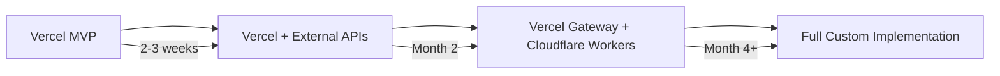

# Flowstate: Vercel vs Custom Implementation Analysis

## Re-examining Flowstate's Unique Requirements

After deep analysis of Vercel's capabilities and flowstate's needs, here's a detailed comparison:

### Flowstate's Core Technical Requirements

1. **Complex Graph Database Operations**
   - Neo4j or similar graph database for context relationships
   - Real-time graph traversal and pattern matching
   - Millions of nodes and edges at scale

2. **Multi-Platform Webhook Ingestion**
   - GitHub, Slack, Jira, Linear, Notion webhooks
   - High-volume event processing (100k+ events/day)
   - Complex event correlation and deduplication

3. **AI/ML Processing Pipeline**
   - Semantic similarity matching across platforms
   - NLP for relationship extraction
   - Predictive context modeling

4. **Real-Time Streaming**
   - WebSocket connections for live updates
   - Server-sent events for context changes
   - Complex pub/sub patterns

5. **Advanced Caching Strategy**
   - Context graph caching
   - Predictive pre-fetching
   - Cross-user cache sharing

## Vercel MCP Template Analysis

### What Vercel Offers

**Strengths:**
- ✅ **Edge Network**: 100+ locations globally for low latency
- ✅ **Streamable HTTP**: Built-in SSE support with Redis
- ✅ **Easy Deployment**: Git push to deploy
- ✅ **Automatic Scaling**: Handles traffic spikes seamlessly
- ✅ **MCP Integration**: Official adapter with best practices
- ✅ **Built-in Monitoring**: Analytics and performance insights
- ✅ **DDoS Protection**: Enterprise-grade security
- ✅ **Serverless Functions**: Auto-scaling compute

**Limitations for Flowstate:**
- ❌ **Function Duration**: Max 5min (Pro), not suitable for long-running graph operations
- ❌ **Memory Limits**: 3GB max, challenging for large context graphs
- ❌ **Database Connections**: Connection pooling limitations with serverless
- ❌ **Stateful Operations**: Designed for stateless, not persistent WebSocket connections
- ❌ **Redis Dependency**: Required for SSE, adds complexity and cost
- ❌ **Cold Starts**: Can impact real-time performance requirements

### Vercel Template Code Analysis

```typescript
// Vercel MCP adapter pattern
const handler = createMcpHandler(
  (server) => {
    server.tool('search_context', 
      'Search across platforms',
      { query: z.string() },
      async ({ query }) => {
        // Limited by 5min execution time
        // No persistent connections to graph DB
        // Cold start impacts
      }
    );
  },
  {},
  { basePath: '/api' }
);
```

## Cloudflare Workers (Custom) Analysis

### What Cloudflare Offers

**Strengths:**
- ✅ **Durable Objects**: Stateful, persistent connections perfect for graph operations
- ✅ **WebSocket Support**: Native support for real-time streaming
- ✅ **Global Network**: Similar edge coverage to Vercel
- ✅ **No Cold Starts**: Workers stay warm
- ✅ **Flexible Pricing**: Pay per request, not execution time
- ✅ **KV Storage**: Built-in for caching without Redis
- ✅ **R2 Storage**: Object storage for large context data

**Considerations:**
- ⚠️ **More Setup**: Requires manual MCP implementation
- ⚠️ **Learning Curve**: Different from traditional Node.js
- ⚠️ **Database Connections**: Need to use HTTP-based APIs

### Custom Implementation Pattern

```typescript
// Cloudflare Workers + Durable Objects
export class ContextGraphDO implements DurableObject {
  private graph: GraphDatabase;
  private connections: Map<string, WebSocket>;
  
  async fetch(request: Request) {
    // Persistent graph operations
    // WebSocket management
    // Real-time streaming
  }
}

// MCP Server implementation
export class FlowstateMCP extends WorkerMCPServer {
  async handleTool(name: string, args: any) {
    // Direct access to Durable Objects
    // No execution time limits
    // Stateful operations
  }
}
```

## Decision Matrix

| Requirement | Vercel Template | Custom (Cloudflare) | Winner |
|------------|----------------|-------------------|---------|
| **Time to Market** | 2-3 weeks | 4-5 weeks | Vercel ✅ |
| **Graph Operations** | Limited by timeouts | Durable Objects ideal | Custom ✅ |
| **Real-time Streaming** | Redis required | Native WebSocket | Custom ✅ |
| **Scaling** | Automatic | Automatic | Tie |
| **Cost at Scale** | Higher (Redis + compute) | Lower (pay per request) | Custom ✅ |
| **Developer Experience** | Familiar Next.js | New paradigm | Vercel ✅ |
| **Flexibility** | Template constraints | Full control | Custom ✅ |
| **Monitoring** | Built-in | Requires setup | Vercel ✅ |

## Revised Recommendation: Hybrid Progressive Approach

### Phase 1: Vercel MVP (Weeks 1-3)
**Use Vercel template for rapid validation**

```typescript
// Start with Vercel MCP template
export default createMcpHandler((server) => {
  // Basic tools for proof of concept
  server.tool('search_context', ...);
  server.tool('link_items', ...);
  
  // Use external APIs for heavy lifting
  // Validate user interest and patterns
});
```

**Benefits:**
- Fastest path to user feedback
- Leverage Vercel's infrastructure
- Focus on product-market fit

### Phase 2: Hybrid Architecture (Months 2-3)
**Keep Vercel as API Gateway, add Cloudflare for heavy lifting**

```typescript
// Vercel remains the MCP interface
export default createMcpHandler((server) => {
  server.tool('complex_search', async (args) => {
    // Delegate to Cloudflare Worker
    const result = await fetch('https://graph.flowstate.workers.dev', {
      method: 'POST',
      body: JSON.stringify({ operation: 'traverse', args })
    });
    return result.json();
  });
});

// Cloudflare handles stateful operations
export class GraphWorker {
  async handleGraphOperation(op: GraphOperation) {
    // Complex graph traversal
    // Long-running operations
    // WebSocket management
  }
}
```

### Phase 3: Full Migration (Month 4+)
**If needed, migrate entirely to custom implementation**

Only if you need:
- Sub-100ms response times globally
- Complex stateful operations
- Custom protocol extensions
- Significant cost optimization

## Final Recommendation

**Start with Vercel MCP Template, but architect for evolution:**

1. **Use Vercel template initially** because:
   - 3x faster time to market
   - Built-in MCP best practices
   - Proven infrastructure
   - Easy team onboarding

2. **Design for migration** by:
   - Keeping business logic modular
   - Using interfaces for external services
   - Avoiding tight coupling to Vercel-specific features
   - Planning data models for both architectures

3. **Migrate strategically** when you hit:
   - 5-minute function timeout limits
   - Need for persistent connections
   - Significant Redis costs
   - Complex graph operations

## Architecture Evolution Path



This progressive approach balances speed to market with long-term scalability, allowing flowstate to validate quickly while maintaining the flexibility to scale into its unique requirements.